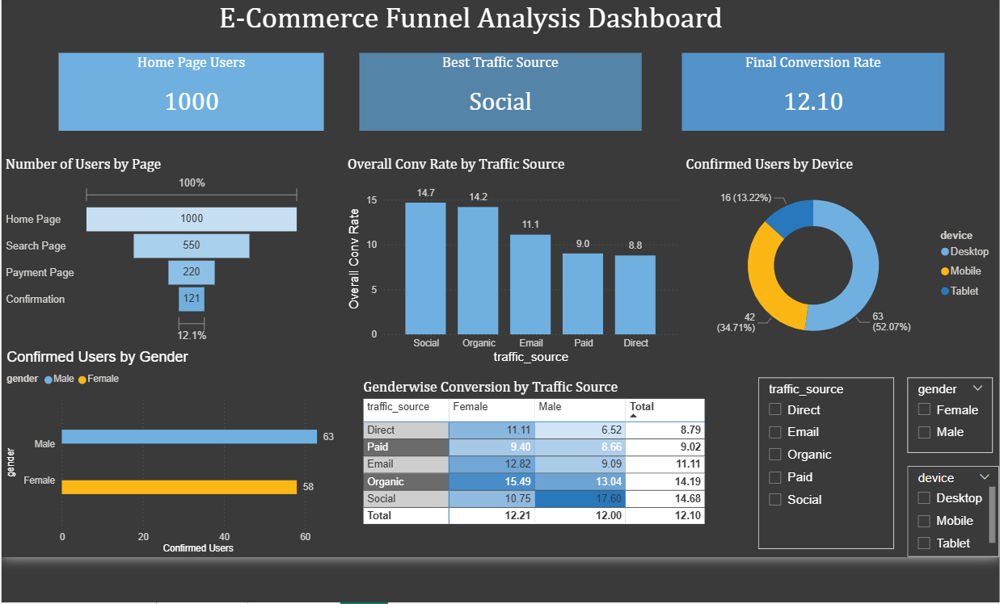

# 📊 E-Commerce Funnel Analysis

## 📌 Project Overview
This project performs an end-to-end **e-commerce funnel analysis** to understand how users progress through a typical online purchase journey. The analysis tracks **1,000 users across four stages of the purchase funnel**, from homepage visit to final order confirmation.

The objective is to identify **where users drop off**, evaluate **conversion performance across marketing channels**, and understand how **customer segments (device, gender, traffic source)** influence purchase behaviour.

The project replicates real-world **product and marketing analytics workflows**, combining SQL analysis, exploratory analysis in Excel, and interactive dashboarding using Power BI.

---
# 📈 Dashboard Preview

---

# 🎯 Objective

The analysis answers the following business questions:

- What is the **overall conversion rate** of the e-commerce funnel?
- At which funnel stage do **users drop off the most**?
- Which **traffic sources drive the highest conversions**?
- How do **device types influence purchase behaviour**?
- Are there meaningful **conversion differences across customer segments**?

The goal is to provide **actionable insights for marketing and product teams** to optimise conversion performance.

---

# 🗂 Dataset Overview

The dataset simulates realistic e-commerce user behaviour across **five relational tables**, representing different stages of the purchase journey.

| Table | Rows | Description |
|------|------|-------------|
| user_table.csv | 1,000 | User attributes including gender, age, country, device type, and traffic source |
| home_page.csv | 1,000 | Users who visited the homepage |
| search_page.csv | 550 | Users who reached the product/search page |
| payment_page.csv | 220 | Users who proceeded to the payment stage |
| confirmation_page.csv | 121 | Users who completed the purchase |

Each table was analysed using **SQL joins** to track user movement through the funnel.

---

# 🛠 Tools and Technologies

### Data Analysis
- Microsoft Excel  
  - Exploratory data analysis  
  - Pivot tables and segmentation  
  - Funnel visualisation

- SQLite  
  - Funnel queries  
  - Join-based segmentation analysis  
  - Drop-off identification

- Python (Pandas)  
  - Dataset generation  
  - SQL execution via notebook environment

### Data Visualisation
- Microsoft Power BI  
  - Interactive dashboard creation  
  - KPI monitoring  
  - Conversion analysis by segment

---

# 🔎 Analysis Methodology

The project follows a structured analytics workflow:

1. Generated a simulated dataset representing **1,000 e-commerce users**
2. Loaded relational CSV tables into SQLite via Python
3. Constructed funnel stage counts using SQL queries
4. Calculated **step-level and overall conversion rates**
5. Performed segmentation analysis by:
   - Gender
   - Device type
   - Traffic source
6. Conducted cross-segment analysis (**Gender × Traffic Source**)
7. Identified drop-off users using `LEFT JOIN` and `IS NULL`
8. Built a consolidated funnel dataset for dashboard visualisation
9. Designed an interactive Power BI dashboard

---

# 📊 Key Findings

| Metric | Value |
|------|------|
| Overall Conversion Rate | **12.1%** |
| Largest Drop-off Stage | **Homepage → Search Page (45%)** |
| Best Traffic Source | **Social (14.7%)** |
| Lowest Traffic Source | **Direct (8.8%)** |
| Best Converting Device | **Desktop (12.6%)** |

### Traffic Source Performance

- **Social (14.7%)** and **Organic (14.2%)** traffic sources generate the highest conversion rates
- **Paid Ads (9.0%)** show weaker performance despite marketing investment
- **Direct traffic (8.8%)** consistently shows the lowest conversion rates

### Customer Segment Insights

- Conversion rates across genders are **nearly identical (~12%)**
- **Organic Female users convert at 15.49%**
- **Social Male users convert at 17.60%**
- Direct traffic performs poorly across all segments

---

# 💡 Business Insights & Recommendations

### Improve Homepage Engagement

The largest drop-off occurs between **Homepage and Search Page**, indicating users may struggle to find products quickly.

**Recommendations**
- Improve homepage product recommendations
- Enhance search visibility
- Add stronger call-to-action elements

---

### Reevaluate Paid Advertising Strategy

Paid marketing campaigns show lower conversion performance compared to organic and social channels.

**Recommendations**
- Optimise ad targeting
- Improve landing page relevance
- Conduct A/B testing on campaigns

---

### Scale High-Performing Channels

Social and organic channels produce the strongest conversion performance.

**Recommendations**
- Increase marketing investment in social campaigns
- Expand organic acquisition strategies
- Retarget high-intent users

---

### Optimise Mobile Checkout Experience

Desktop users show slightly higher conversion rates than mobile users.

**Recommendations**
- Improve mobile checkout UX
- Reduce payment form friction
- Simplify navigation

---

# 🚀 How to Run the Project

1. Clone this repository
2. Upload CSV files into your analysis environment
3. Run SQL queries inside the `sql` notebook
4. Open the dashboard file in **Power BI Desktop**
5. Use filters to explore conversion behaviour
